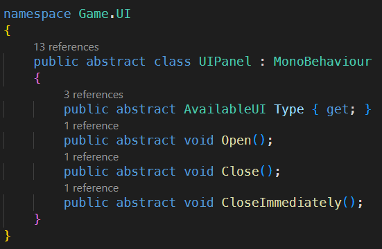

# Snowball Game

A snowball game for INFOMAIGT course assignment at Utrecht University 2023 - 2024. [The game is avilable on itch.io](https://huienlin.itch.io/snowball-game).


> Do not push any commits to the `main` and `develop` branches directly. Instead, you should create a new branch and a pull request for merging.

# Unity Version

**2022.3.8f1**

> Should always keep the same version with your team.

## Version Control

This project follows [GitFlow](http://datasift.github.io/gitflow/IntroducingGitFlow.html) version control rules, but not that strict.

Hereby a brief guide:

- For the `main` branch, you cannot push commits into it directly. It can only be merged from any `release` branch with a pull request. We need to make sure that every version of the `main` branch is the latest production-ready game.
- For the `develop` branch, you cannot push commits into it directly. It can only be merged from any `feature/xxx_xxx` branch with a pull request. We need to make sure that every version of the `develop` branch is a runnable game.
- If you want to add a new feature or maybe refactor any code structure, **you should create a branch named `feature/the_name_of_feature` from the develop branch.** When the branch is finished, you can create a pull request for updating the `develop` branch.
- When a `develop` branch is ready to be published, you can create a pull request to create a `release/vx.x.x` branch. The name of a branch could be `release/v0.0.1` or `release/alpha1`.

## Preferred IDE

[Visual Studio Code](https://code.visualstudio.com/)

### Working With VSCode

Installing [**Mono**](https://www.mono-project.com/download/stable/) and [**.NET core**](https://dotnet.microsoft.com/en-us/download) beforehand is necessary in order for VScode to work properly.

For more information see this offical [article](https://code.visualstudio.com/docs/other/unity).

### Recommend VSCode Extension

[**C#**](https://marketplace.visualstudio.com/items?itemName=ms-dotnettools.csharp)

[**Prettier - Code formatter**](https://marketplace.visualstudio.com/items?itemName=esbenp.prettier-vscode)

[**Unity**](https://code.visualstudio.com/docs/other/unity)

### Set VSCode as External Script Editor for Unity

Open Unity -> `Edit` > `Preferences` > `External Tools`: Modify `External Script Editor` to **Visual Studio Code**

If it works well, you will see references of any class, function and property.


## How To Test

You can start the demo by opening the `System` scene in Unity and press the Play button. After then, you will start in the `Menu` scene which present a menu panel. The purpose of `System` scene is to initialize system managers like UIManager and EventManager and more before the game starts.

## Coding Style Example

```csharp
public class CharacterStatus
{
    // private values should with a prefix _
    private int _hp;
    private int _physicalDefence;
    private int _magicDefence;

    // treat getters as functions, so should start with capital letter
    public int HP { get => _hp; }
    public int PhysicalDefence { get => _physicalDefence; }
    public int MagicDefence { get => _magicDefence; }

    public string name;

    public void TakeDamage(int damage)
    {
        _hp -= damage;
    }
}
```

## Folder Structure

```
Assets/
├─ DynamicAssets/ /* Dynamic assets usually means that the assets is
│                    not always with the game itselfs. It might be
│                    downloaded externally. Like DLCs(?) */
├─ Plugins/ /*For third party and custom plugins, libararies */
├─ Presets/
├─ Samples/ /* Generated by ProBuilder, you shouldn't touch it
├─ Resources/ /* generated by DOTween, you shouldn't touch it */
├─ Scenes/ /* System scenes */
├─ StaticAssets/ /* Normally put your assets here */
│  ├─ Materials/
│  ├─ Scenes/ /* This is the folder for level scenes */
│  ├─ Audios/
│  ├─ Sprites/
├─ TextMesh Pro/ /* Generated by TextMesh Pro */
├─ ThirdpartyAssets/ /* If you buy any pack of models, sprites,
│                       sounds, put it here */
├─ URP/ /* URP, post processing data */
```

## User Guideline

### Add a scene

Before adding a scene, you should know the scene structure of this template. Initially, there are three scenes: `System`, `Menu`, and `MainGame`.

`System` is the scene for game objects that need to persist or be excluded from levels. For example, game manager, UI manager, and UI canvas.

`Menu` and `MainGame` are switchable scenes. While `System` is persistent, these two scenes could be loaded/unloaded with the SceneLoader class.

Basically, you can add as many scenes as you want. Please keep in mind that the `System` scene should always persist and should not be unloaded.

To add a new scene, hereby following steps:

#### Step 1 - Create a scene


#### Step 2 - Save it to `StaticAssets\Scenes`


#### Step 3 - Add scene to BuildSettings


#### Step 4 - Declare it in AvailableScene.cs, SceneResources.cs and SceneLoader.cs

```csharp
/* Scripts/SceneLoader/AvailableScene.cs */
public enum AvailableScene
{
    Menu,
    MainGame,
    NewScene
}

/* Scripts/Resources/SceneResources.cs */
    public class SceneResources : ScriptableObject
    {
        [Header("Scenes")]
        ...
        [Required("Must link a scene asset")]
        [Scene]
        public string NewScene;
    }

/* SceneLoader.cs */
public class SceneLoader
{
    ...
    public string GetSceneName(AvailableScene scene)
    {
        switch (scene)
        {
            ...
            case AvailableScene.NewScene:
                return ResourceManager.instance.SceneResources.NewScene.GetSceneNameByPath();
        }
    }
}
```

#### Step 5 - Bind it into SceneResources

Bind the scene object into StaticAssets/ScriptableObject/Resources/SceneResources


#### Final

Now, you can load scenes programmally by calling game manager.

```csharp
GameManager.instance.SwitchScene(AvailiableScene.NewScene);
```

### Adding an UIPanel

#### Step 1 - Create an UIPanel object

For editing UIs, you can open the `UIEditing` scene to do it.
To create an UI panel object, right click the canvas and find:
`UI/Custom Components/EmptyPanel` or `UI/Custom Components/EmptyPanel(with background)`.


#### Step 2 - Add some UI Components to the panel

The figure in the last step shows some UI components available. Objects in `Custom Components` are some useful components made by me.

To add UI images, I highly recommend using Procedural Image instead of the built-in Image component in Unity.

With existing UI components, you are already able to create many kinds of UI panels. There are already some examples in this template.


#### Step 3 - Save it to `StaticAssets\UI`

Remember to create a folder for your panel. It will be easier to find when UI panels grow.

#### Step 4 - Declare it in AvailableUI.cs, UIPanelResources.cs, and UIManager.cs

```csharp
/* Scripts/UI/AvailableUI.cs */
public enum AvailableUI
{
    MenuPanel,
    GameHUDPanel,
    NewPanel
}

/* Scripts/Resources/UIPanelResources.cs */
public class UIPanelResources : ScriptableObject
{
    [Header("UI Panels")]
    [Required("Must link a ui panel asset")]
    [AssetsOnly]
    public GameObject MenuPanel;
    [Required("Must link a ui panel asset")]
    [AssetsOnly]
    public GameObject GameHUDPanel;
    [Required("Must link a ui panel asset")]
    [AssetsOnly]
    public GameObject MewPanel;
}

/* Scripts/UI/UIManager.cs */
public class UIManager : Singleton<UIManager>
{
    ...
    public GameObject GetUIPrefab(AvailableUI ui)
    {
        switch (ui)
        {
            ...
            case AvailableUI.NewPanel:
                return ResourceManager.instance.UIPanelResources.NewPanel;
            default:
                return null;
        }
    }
}
```

#### Step 5 - Create a UIPanel class

Save it to `Scripts/UI/Panels`

```csharp
public class NewPanel : UIPanel
{
    public override AvailableUI Type { get => AvailableUI.NewPanel; }

    public override void Open()
    {
        gameObject.SetActive(true);
    }
    public override void Close()
    {
        gameObject.SetActive(false);
    }
    public override void CloseImmediately()
    {
        gameObject.SetActive(false);
    }
}
```

#### Step 6 - Bind it into UIPanelResources

Bind the panel object into StaticAssets/ScriptableObject/Resources/UIPanelResources


#### Final

Now, you can open UI panels programmally by calling `UIManager`.

```csharp
NewPanel newPanel =
          UIManager.instance.OpenUI(AvailableUI.NewPanel) as NewPanel;
```

## Implemented Features

### EventManager

We sometimes need global events for the implementation, such as achievement system, eventbrodcasting. EventManager can send global events to subscribers to reach this problem.

#### Declare a event

Before we can send an event, we need to declare it in EventManager.

```csharp
public class EventNames
{
    /*
    args
    {
        int gold
    }
    */
    public static EventName EarnedGold = new EventName("EARNED_GOLD", false);
}
```

#### Subscribe a event

```csharp
public class AchievementSystem
{
    private Subscription _earnedGoldEventSub;

    private void Start()
    {
        _earnedGoldEventSub =
          EventManager
          .Subscribe(
              IDENTITY,
              EventNames.EarnedGold,
              (e) =>
              {
                    int gold = (int)e.args[0];

                    Debug.Log($"Player earned {gold} of gold");
                    // check if it unlocks "Gain 10000000 gold" achievement
              });
    }

    // remember to cancel subscription on destory, if this gameobject
    // usually destroy with the game, then this might not be mandatory
    private void OnDestroy()
    {
        EventManager.CancelSubscription(
            EventNames.EarnedGold, _earnedGoldEventSub);
    }
}
```

#### Send a event

```csharp
EventManager.Publish(
    EventNames.EarningGold,
    new Payload()
    {
        args = new object[] { 10000 }
    }
);
```

### SceneLoader

When setting up a new Unity project, we usually spend a lot of time working on scene management. This feature makes the process easier. In addition, if you want to know when the scene has been loaded, you can use an async await function to wait for it.

```csharp
public async void SwitchScene()
{
    // Do something before loading scene
    await sceneLoader.SwitchScene(scene);
    // Do somethign after loaded
}
```

However, you do not actually using the above function because it is already handled by `GameManager`. :)

```csharp
GameManager.instance.SwitchScene(AvailableScene.Menu);
```

### DIContainer

While writing a script, it is often annoying to bind the script to a GameObject. Sometimes you even do not use the functions of the UnityEngine namespace.

Alternatively, you might want to use singletons. But you sometimes run into a problem: these Singleton classes have strong relatations, for example, the achievement system might want to be initialized after event system. Two Singletons will not be able to know each others status easily. The situation is getting worst when we have more Singletons!

Therefore, it would be a good idea to have only one object handling these classes. That's why we need DIContainer.

### Add an object

To add an object to DIContainer, you just need to register it in the `SetUp()` function.

```csharp
public partial class DIContainer : Singleton<DIContainer>
{
    protected void SetUp()
    {
        Register<EventManager>(() => new EventManager());
        Register<AchievementSystem>(() => new AchievementSystem(
          GetObject<EventManager>()
        ));
        // nice :)
    }
}
```

### Get an object

When you want to use an object from DIContainer, you can obtain it like the following:

```csharp
public class WorldLog : Monobehaviour
{
    private Lazy<EventManager> _eventManager = new Lazy<EventManager>(
      () => DIContainer.instance.GetObject<EventManager>(), true);

    protected EventManager EventManager { get => _eventManager.Value; }

    private Subscription _bossKilledEventSub;

    private void Start()
    {
        EventManager
          .Subscribe(
              IDENTITY,
              EventNames.BossKilled,
              (e) =>
              {
                  string bossName = (string)e.args[0];

                  Log($"{bossName} has been killed!!!!!");
              });
    }
}
```

### UI Manager

Breiflly say, it is for UI Management. The panels are handling in a stack. Interfaces could be push into or pop from the stack.

#### Open an UIPanel

```csharp
public class MenuScene : GameScene
{
    void Start()
    {
        MenuPanel manuPanel =
          UIManager.instance.OpenUI(AvailableUI.MenuPanel) as ManuPanel;
    }
}
```

#### Close an UIPanel

```csharp
public class MenuPanel : UIPanel
{
    void Start()
    {
        btnClose
          .ButtonDidClick
          .ObserveOnMainThread()
          .Subscribe(_ => UIManager.instance.Prev())
          .AddTo(this);
    }
}
```

#### Close all UIPanel

```csharp
public class GameManager : Singleton<GameManager>
{
    void Start()
    {
        sceneLoader
          .LoaderWillLoadScene
          .ObserveOnMainThread()
          .Subscribe(_ => UIManager.instance.CloseAllUI())
          .AddTo(this);
    }
}
```

### UI Components

In order to better control Unity UI components, I suggest writing your own components instead of using Unity's built-in components directly because it is so messy.

However, it does not means that you need to write the UI components from scratch. It is just extending functions from the built-in components.

For that, I already wrote some basic components for fast editing: `WDText`, `WDButton`, and `WDTextButton`.

Here is some short snippet for the code:

```csharp
public class WDTextButton : WDButton, IWDText
{
    public WDText text;

    public void SetText(string t)
    {
        text.SetText(t);
    }

    public void SetTextColor(Color32 color)
    {
        text.SetTextColor(color);
    }
}
```

Basically, `WDButton` handles hover animation and on click listener, `WDTextButton` extends it then add the text&color editing functions.

Additionally, you can also implement an icon button:

```csharp
public class IconButton : WDButton
{
    public Image icon;

    public void SetIcon(Sprite sprite)
    {
        icon.sprite = sprite;
    }
}
```

## Imported Plugins

[DOTween](http://dotween.demigiant.com/) - A fast, efficient, fully type-safe object-oriented animation engine for Unity. Usually used for UI animations in this project. It is also useful in gameplay

[UniRx](https://github.com/neuecc/UniRx) - Reactive Extensions for Unity, usually be used for UI Programming in this template

[UniTask](https://github.com/Cysharp/UniTask) - Provides an efficient allocation free async/await integration for Unity

[Odin Inspector](https://odininspector.com/) - Very powerful Editor plugins, supporting Dictionary serialization

[ProceduralUIImage](https://assetstore.unity.com/packages/tools/gui/procedural-ui-image-52200) - Useful fast UI development tool

## Custom Plugins

### Common Patterns

For now I only made a singleton class. It is very easy to use.

> Note that it is generally not a wise idea to have too many singletons in a game. The code would be a mess.

```csharp
using WillakeD.CommonPatterns;

public class GameManager : Singleton<GameManager>
{
    // your code
}
```

### Scene Property Drawer

It is a plugin for showing scene object on inspector, so that users can drag and drop on that.

```csharp
using WillakeD.ScenePropertyDrawer;

public class SceneLoader : MonoBehaviour
{
    [SerializeField]
    [Scene]
    private string _menu;
    public string Menu { get => _menu; }
}
```


## TODO

- [ ] Input manager intergrate with new Unity input system
